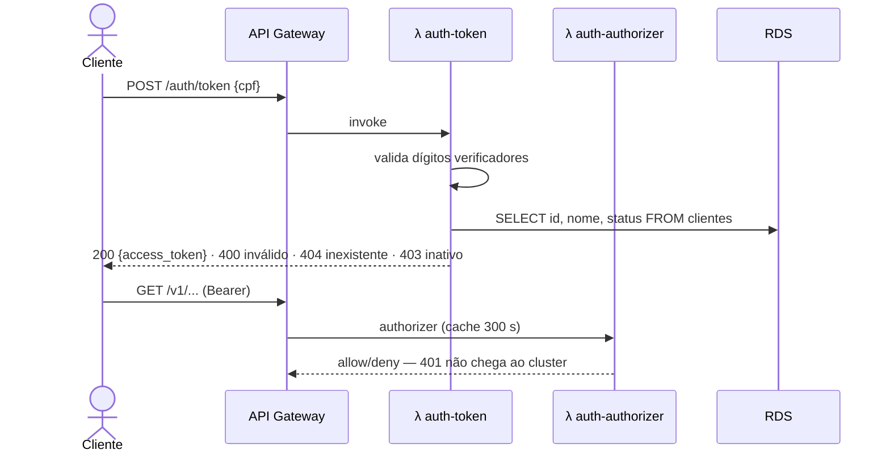

# oficina-lambda-auth

> Autenticação **serverless por CPF** da oficina: duas AWS Lambda em Go que emitem e validam o JWT usado pelas APIs protegidas.

Parte do Tech Challenge — Fase 3. Repositórios irmãos: [oficina-app](https://github.com/ProblemaTheu/oficina-app) · [oficina-infra-k8s](https://github.com/ProblemaTheu/oficina-infra-k8s) · [oficina-infra-db](https://github.com/ProblemaTheu/oficina-infra-db)

## Papel na arquitetura



| Função | Responsabilidade |
|---|---|
| `auth-token` | Valida o CPF, consulta existência **e status** do cliente, emite JWT HS256 (1 h) |
| `auth-authorizer` | Valida assinatura, `exp`, `iss` e `aud` na borda, antes de qualquer chamada ao cluster |

## Tecnologias

| Tecnologia | Versão | Uso |
|---|---|---|
| Go | 1.26 | Linguagem |
| `provided.al2023` / arm64 | — | Runtime Lambda (Graviton: mais barato e rápido) |
| golang-jwt/v5 | — | Emissão e validação HS256 |
| Terraform | 1.15.7 | Funções, IAM e rotas no API Gateway |

## Estrutura

```
cmd/auth-token/        handler de emissão do token
cmd/auth-authorizer/   handler do authorizer do API Gateway
internal/cpf/          validação de dígitos verificadores (sem dependência externa)
internal/token/        contrato de claims compartilhado com a aplicação
internal/segredo/      Secrets Manager com cache por container
terraform/             funções, IAM, integração e rotas
Makefile               empacota as funções em dist/*.zip
```

## Empacotamento

```bash
make build   # dist/auth-token.zip e dist/auth-authorizer.zip
make test    # go test ./... -race -cover
```

O runtime `provided.al2023` tem duas exigências que **falham em silêncio** quando erradas: o binário dentro do zip precisa se chamar `bootstrap`, e a arquitetura precisa casar com a declarada na função — aqui, `arm64`.

## Execução local

```bash
go test ./...        # a validação de CPF é lógica pura e tem tabela de casos
go vet ./... && golangci-lint run
```

## Build e deploy

O binário **precisa** se chamar `bootstrap` no runtime `provided.al2023`:

```bash
CGO_ENABLED=0 GOOS=linux GOARCH=arm64 go build -trimpath -ldflags="-s -w" \
  -o dist/auth-token/bootstrap ./cmd/auth-token
```

`.github/workflows/ci-cd.yml`:

| Evento | Jobs |
|---|---|
| PR para `homolog` ou `main` | `gofmt`, `go vet`, build, testes com `-race`, `gitleaks`, e `terraform plan` comentado no PR (role `gha-oficina-lambda-auth-plan`, só leitura) |
| push na `main` / disparo manual | testes → `make build` → `terraform apply` no *environment* `prod` → smoke test: `POST /auth/token` com CPF inválido tem que responder `400` |

O deploy do código é feito pelo Terraform (`source_code_hash`), não por `aws lambda update-function-code` — misturar os dois gera drift permanente no plan. Por isso o PR também compila: sem os zips o plan nem começa, e como o build é reproduzível (`-trimpath`), código igual dá hash igual e o plan mostra `0 to change`.

## Contrato com os outros repositórios

**Consome:** `/oficina/shared/vpc/subnets_privadas`, `/oficina/shared/lambda/sg_id`, `/oficina/{env}/apigw/id`, `/oficina/{env}/db/*`, `/oficina/{env}/jwt/secret_arn`

**Publica:** `/oficina/{env}/apigw/authorizer_id` — consumido pelo `oficina-infra-k8s` para proteger as rotas `/v1/*`

## Dockerfile

Não aplicável: as funções são empacotadas em **zip** para o runtime `provided.al2023`, mais leve e com cold start menor que imagem de container.

## Segurança

- O CPF **nunca** é registrado em log (dado pessoal — LGPD)
- O segredo do JWT vem do Secrets Manager, com cache por container
- `jwt.WithValidMethods(["HS256"])` impede o ataque `alg=none`

## Documentação

Contrato de claims e decisões de autenticação em [oficina-app/docs](https://github.com/ProblemaTheu/oficina-app/tree/main/docs).
